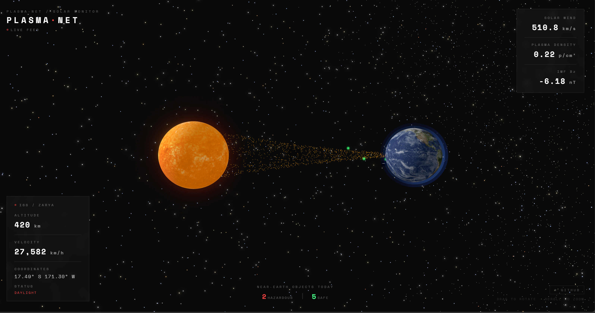

# Plasma-Net

**[→ Live Demo](https://mujib77.github.io/plasma-net/)**

A real-time 3D space dashboard built with Three.js and a Go backend. Shows live ISS position, actual solar wind data from NOAA satellites, and near-Earth asteroids from NASA — all rendering in your browser, no install needed.



---

## What it shows

The ISS dot on Earth is the actual position right now. It updates every 5 seconds. The particle stream between the Sun and Earth is driven by real NOAA solar wind readings — when the wind is slow it's blue, when it's fast it goes orange/red. The colored dots around Earth are today's near-Earth asteroids from NASA: red means potentially hazardous, green means safe pass.

Everything in the HUD is live:
- **ISS altitude, velocity, coordinates, daylight/eclipse status** — wheretheiss.at API
- **Solar wind speed, plasma density, IMF Bz** — NOAA SWPC
- **Near-Earth object count** — NASA NEO API

---

## Stack

**Frontend**
- React + Vite
- Three.js + React Three Fiber
- Custom GLSL shaders for Sun corona and Earth atmosphere
- Custom particle system for solar wind stream
- Space Mono font

**Backend**
- Go — polls NOAA every 60 seconds, caches data, serves with CORS headers
- Deployed on Render

**APIs (all free, no key needed except NASA)**
- [wheretheiss.at](https://wheretheiss.at) — ISS position
- [NOAA SWPC](https://www.swpc.noaa.gov) — solar wind mag + plasma data
- [NASA NEO](https://api.nasa.gov) — near-Earth asteroids

---

## Run locally

You need Go and Node installed.

**Start the backend:**
```bash
cd backend
go run main.go
```

**Start the frontend:**
```bash
npm install
npm run dev
```

Open `http://localhost:5173`

The backend runs on `:8080` and the frontend proxies solar wind requests through it to avoid CORS issues with NOAA.

---

## How the solar wind visualization works

NOAA publishes magnetometer and plasma readings every minute from the DSCOVR satellite at the L1 Lagrange point. The Go backend fetches `mag-1-day.json` and `plasma-1-day.json`, grabs the latest reading, and exposes it at `/api/solar`.

The frontend reads solar wind speed and maps it to particle color and animation speed:

| Speed | Color | Condition |
|-------|-------|-----------|
| < 400 km/s | Blue | Slow wind |
| 400–500 km/s | Yellow | Normal |
| 500–600 km/s | Orange | Fast wind |
| > 600 km/s | Red | Storm |

When IMF Bz drops below -10 nT the HUD shows a geomagnetic storm warning.

---

## Project structure

```
plasma-net/
├── src/
│   ├── components/
│   │   ├── Sun.jsx          # Sun with sprite-based corona glow
│   │   ├── Earth.jsx        # Earth with atmosphere layers
│   │   ├── ISS.jsx          # Live ISS position, updates every 5s
│   │   ├── Particles.jsx    # Solar wind particle stream
│   │   ├── Asteroids.jsx    # NASA NEO dots around Earth
│   │   ├── StarField.jsx    # 20k stars + Milky Way band
│   │   └── HUD.jsx          # Overlay UI panels
│   └── hooks/
│       └── useSolarWind.js  # NOAA data hook
└── backend/
    └── main.go              # Go server, NOAA polling, cache
```

---

## Roadmap

- [x] v0.1.0 — Live ISS tracking
- [x] v0.2.0 — Solar wind visualization + NASA asteroids + Go backend
- [ ] v0.3.0 — Black hole mode with accretion disk reacting to live solar wind
- [ ] v0.3.0 — CME particle eruptions from Sun
- [ ] v0.3.0 — ISS orbit trail

---

## Why I built this

I wanted to see if live space weather data could actually look good in a browser. Most space visualizations are either scientifically accurate and ugly, or beautiful and fake. This tries to be both — the ISS dot is where the ISS actually is, the solar wind speed number is from a satellite sitting 1.5 million km from Earth, and the asteroids are real objects NASA is tracking today.

---

## Contributing

Issues and PRs welcome. If you want to add a feature check the roadmap first — v0.3.0 is going to be a big visual update and I have a rough plan for it.

---

*Live data refreshes: ISS every 5s · Solar wind every 60s · Asteroids daily*